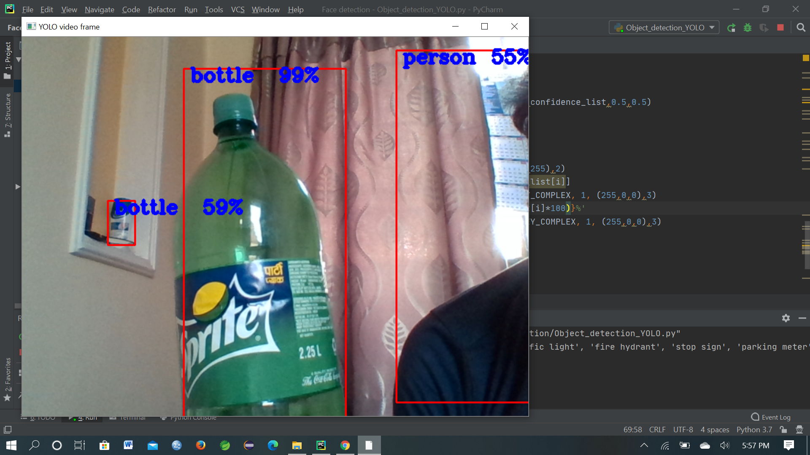

# YOLOV3_object_detection
Using YOLOV3 to detect, classify, and label the objects.

<ul>
  <li>At first, we need to load the cnn.</li>
  <li>Convert each frame read from camera into blob type because cnn can only handle blob type images.</li>
  <li>Set the converted blob type image as an input to the network.</li>
  <li>Now that we have provided the input we require an output.</li>
  <li>There are three outputs for a single detected objects.</li>
  <li>Find the name of the output layers to find the outputs of the three layers.</li>
  <li>Compute bounding box coordinates, class name, and confidence fo the detected object.</li>
  <li>Draw rectangle, put label and confidence over the detected object on the frame.</li>
</ul>

<b>Look at the manual provided in this repo for detail explanation.</b>
